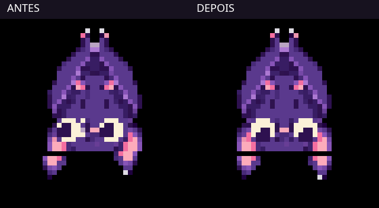

# Flight — ritmo e contato

Esta iteração mantém os assets e a mecânica de steering/arrive da versão
320312a. A comparação usa capturas do renderer Bevy a 12 fps, em tempo real,
sem interpolação ou alteração de velocidade:

## Observação e decisão

O corpo inteiro alternava um pixel para cima/baixo a cada pose, criando
trepidação no rosto. O relógio das asas reiniciava em cada estado. Em Landing,
o limite de 64 px selecionava a silhueta pendurada já no começo da aproximação
de 24 px: o morcego terminava a subida com as asas fechadas.

A intenção visual agora conserva a fase entre estados. O ritmo base é 2,6 Hz,
com recuperação mais longa; velocidade e aceleração para cima aumentam
moderadamente a frequência. A pausa aérea mantém batidas de sustentação.
Não há aleatoriedade nem novos frames.

O rosto fica estável durante o voo. A respiração congelada do idle não desloca
os olhos em relação à textura aérea. O movimento de um pixel do corpo fica
restrito à preparação e à absorção do contato, com as garras fixas.

As asas permanecem abertas durante Landing. A 12 px do destino há uma breve
pose aberta de preparação; o rig pendurado só volta quando arrive confirma
contato. O corpo cede um pixel por 0,12 s antes de relaxar.

## Alteração mecânica limitada

Takeoff espera 0,24 s antes de integrar movimento, preservando o apoio durante
a antecipação. Landing permanece ancorado durante 0,22 s de recuperação.
A decisão de terminar Landing continua no sistema de movimento, independente
do renderer. Alvos, velocidades máximas, aceleração máxima, steering, arrive
e Perch não foram alterados.

## Validação e limites

Executados cargo fmt --all, cargo check --workspace e cargo test --workspace
(70 testes). Os testes de apresentação exercitam o código usado pelo sistema:
continuidade de fase, equivalência entre 30/120 Hz, sustentação em repouso
aéreo e fechamento apenas após contato.

Executado cargo run --bin batpet-desktop -- --flight-loop, além de ciclos
capturados com --review-flight --flight-once. As sequências de saída, voo,
aproximação, contato e retorno ao Alive foram comparadas por quadros.
Os logs confirmam ciclos repetidos completos. Esta inspeção por capturas
não equivale a uma avaliação humana contínua do movimento na tela.

A excursão ainda é curta e quase vertical. Os quatro frames têm pouca
articulação da membrana; falta uma recuperação que dobre a asa, e a troca
entre asas abertas e rig pendurado ainda é discreta. O batimento acompanha
o movimento, mas não produz força física. Esta passagem melhora continuidade
e contato; não pretende resolver essas limitações com oscilação adicional,
redesenho ou expansão da arquitetura.
